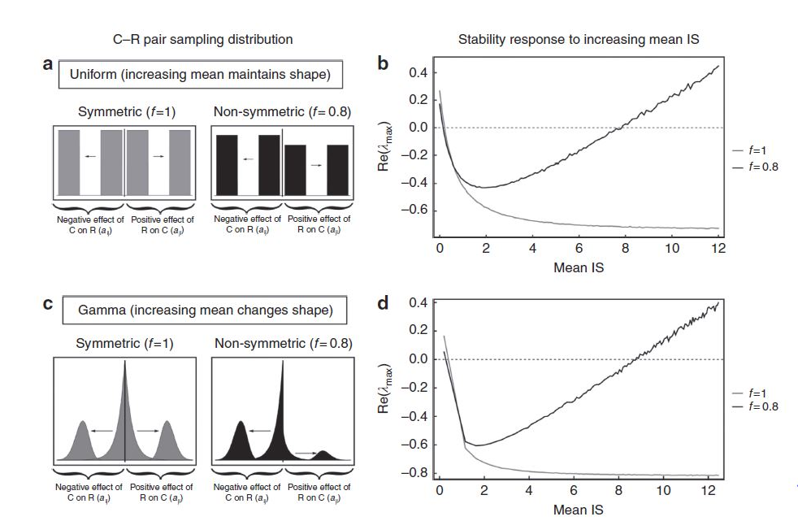

Past lab member Dr. Gabriel Gellner, now in University of California Davis with Alan Hastings, publishes a theoretical paper on the role of growth, energy and interaction strength on modules to whole matrices with PI Kevin McCann (paper on [researchgate](https://www.researchgate.net/publication/301222508_ARTICLE_Consistent_role_of_weak_and_strong_interactions_in_high-and_low-diversity_trophic_food_webss)). Gellner shows that while recent results have found potential differences that there is actually a consistent dynamical response (in terms of local stability analysis) from very simple low species models to speciose whole food webs. The results also show that IS (interaction strength) seems to be destabilizing whenever the eigenvalues are complex in modules. Biologically speaking  this suggests that when lags are expressed (e.g., predator and prey overshoot with a lag when the dominant eigenvalue is complex), then greater interaction strength tends to destabilize the ecosystem (lagged responses are amplified). When lags are not expressed (monotonic trajectories towards equilibrium) then the system is only stabilized by increased interaction strength. Nonetheless, although consistent for very complex systems (i.e., a stabilizing phase followed by a destabilizing phase of interaction strength) it remains to understand how this plays out in terms of eigenvalues as the problem is far more complex.

